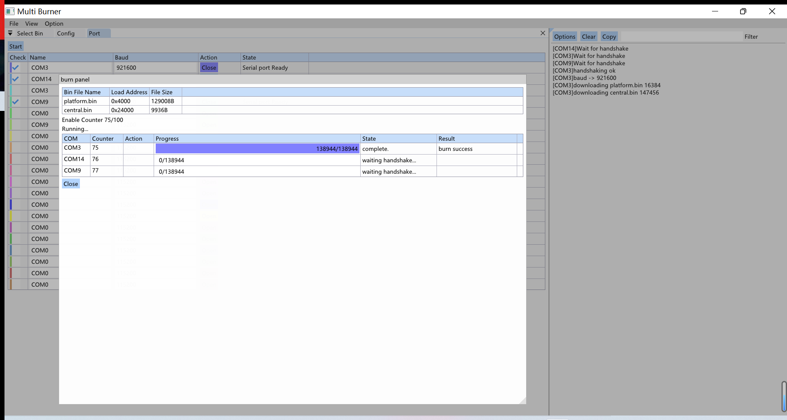

# 一对多烧录器上位机软件

通过GUI操作配置监听多个串口进行批量一对多烧录，特性如下

- 最多监听20个串口，并行烧录
- 最多配置6个固件
- 支持个人化（基于Python）
- 支持地址递增烧录



## 界面介绍

- 固件配置界面
- 串口配置界面
  - 烧录运行界面
- 选项配置界面
  - 脚本编辑界面
- 日志界面

### 固件配置界面

用于配置烧录的固件以及烧录的目标地址，最多可配置6个固件


### 可选项配置界面

用于配置烧录过程中的可选项，包括：

- Main：包含芯片系列的配置

- Protection：烧录保护
- Script：个人化脚本配置，可配合Counter实现地址递增烧录
- Counter：内置计数器，一般用于地址递增烧录


### 脚本编辑界面

内置的编辑工具，默认保存在根目录下的intercept.py文件中，暂不支持导入，可以复制粘贴

- 保存 File/Save  或者快捷键 Ctrl+S
- 退出 File/Quit 或者快捷键 Esc
- 内置 burner 模块，提供烧录工具的一些功能，比如burner.AppendLog(...)可以将脚本执行过程中的日志打印在烧录工具的日志界面，通过import burner导入模块
- on_start_bin函数在每个bin烧录之前执行，参数data就是当前bin文件的二进制数据


### 串口配置界面

用于配置监听的串口

1. 输入串口名称以及波特率
2. 点击Open按钮，State列显示Serial port Ready
3. 让Check列处于选中状态


在串口配置界面中点击Start就会打开烧录运行界面，满足State列显示“Serial port Ready”并且Check列为已选中状态的配置项会在烧录运行界面中显示，并在接下来的烧录过程中被监听

### 烧录运行界面

烧录界面展示每个串口的烧录状态和进度


当在串口配置界面点击Start按钮的时候，会打开烧录运行界面。

烧录会一轮一轮地进行，每轮都会对所有配置的串口进行烧录流程，如果全部都烧录成功，则会自动进入下一轮，如果任何一个烧录失败了，就需要点击Restart按钮重新进行当前这一轮

如果开启了Counter，就会在每一轮开始的时候自动分配Counter值到每个串口烧录上下文，当前轮全部烧录成功时，全局的Counter才会增加对应次数。当Counter到达Counter Limit的时候，烧录就会停止

每个串口烧录的大致流程：


## 示例：批量地址递增烧录

1. 配置需要烧录的固件
2. 配置可选项Counter 和 Script
3. 编写Script
4. 配置串口号
5. 开始烧录

目前暂时先用两个916的开发板进行演示，当程序等待两个串口的握手数据时，同时按下两个916开发板的GPIO0和RST按键就能使芯片进入download状态并发送握手数据


### 1、配置需要烧录的固件

这里就用一个简单的读取flash中自增地址信息的程序来进行验证，地址信息固定存储在0x2038000共4个字节


除了Platform.bin和App.bin以外，还配置了一个专门用来烧录地址的bin文件，大小为4 Byte


### 2、配置可选项Counter 和 Script


配置Main/Family为ing916，使能Script和Counter，Counter Current的值305419896对应16进制的0x12345678，例程中也是用16进制打印，方便观察结果

### 3、编写脚本

当bin_index为2的时候（bin_index从0开始，也就是烧录addr这一项的时候），将Counter写入到data并返回更新后的数据

```python
import burner

# return abort_flag, new_data
def on_start_bin(batch_counter: int, bin_index: int, data: bytes):
    if bin_index != 2:
        return False, data
    ba = bytearray(data)
    addr = batch_counter.to_bytes(4, 'little')
    ba[0:4] = addr
    
    burner.AppendLog('[Script]Data Size %d Counter:%d\n' % (len(data), batch_counter))
    
    return False, bytes(ba)
```

### 4、配置串口号### 

配置完串口号和波特率后，点击Open按钮启用


### 5、开始烧录

点击串口配置界面的Start按钮打开烧录运行界面，并同时按下916开发板上的GPIO0和RST按钮，因为是手动按的所以可能并不算同时，但是烧录过程是并行执行的


查看打印


可以看到两个程序从flash里读出的地址分别是78:56:34:12和79:56:34:12符合预期
